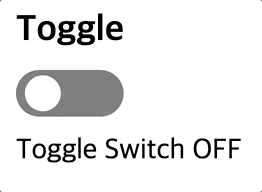

# wanted_pre_onboarding

## ⛏ Skills

- HTML5, CSS3
- React.js
- React Hooks
- Styled-components

## 🧑‍🎨 구현기능

✅ Toggle



- Modal
- Tab
- Tag
- AutoComplete
- ClickToEdit

## 🙆 프로젝트 실행방법

#### 1. custom-component 폴더로 이동

```
$ cd custom-component
```

#### 2. package 설치

```
$ npm install
```

#### 3. 프로젝트 실행

```
$ npm start
```

## 💬 구현방법 및 이유

> 구현한 방법 및 해당 방법을 이용한 이유

### ✅ Toggle

Toggle이란 상태가 두 가지만 존재하여, 두 가지 상태 사이에서의 전환을 반복하는 것을 의미하기 때문에 React의 `useState Hooks` 를 통해 상태를 지정했습니다.

HTML에서 두 가지 선택지로 반복하는 대표적인 태그는 `<input type='checkbox'>` 체크박스를 사용했고,
체크박스의 상태를 변경시킬 때마다 `하얀색 공`의 위치와 배경색이 몇초에 걸려 바뀌기 때문에 애니메이션 기능을 사용했습니다.

## 🔥 Error Handling Log

> 구현하면서 어려웠던 점과 해결 방법

### Toggle 

가이드라인을 보면, 변경된 배경색이 점점 넓어지면서 바뀌어지는데
지금 나는 배경색 자체를 서서히 바뀌도록 구현했다.

공의 배경이 되는 label 위에 새로운 div 혹은 label을 감싸도록 하거나 
좀 더 찾아봐야겠다.
