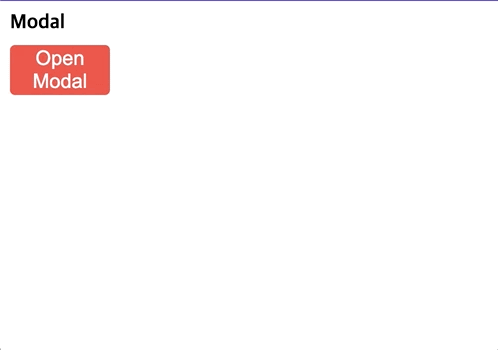

# wanted_pre_onboarding

## ⛏ Skills

- HTML5, CSS3
- React.js
- React Hooks
- Styled-components

## 🧑‍🎨 구현기능

✅ Toggle


✅ Modal



✅ Tab


✅ Tag


<!-- - AutoComplete
- ClickToEdit -->

## 🙆 프로젝트 실행방법

#### 1️⃣ custom-component 폴더로 이동

```
$ cd custom-component
```

#### 2️⃣ package 설치

```
$ npm install
```

#### 3️⃣ 프로젝트 실행

```
$ npm start
```

## 💬 구현방법 및 이유

> 구현한 방법 및 해당 방법을 이용한 이유

✅ Toggle

Toggle이란 상태가 두 가지만 존재하여, 두 가지 상태 사이에서의 전환을 반복하는 것을 의미하기 때문에 React의 `useState Hooks` 를 통해 상태를 지정했습니다.

HTML에서 두 가지 선택지로 반복하는 대표적인 태그는 `<input type='checkbox'>` 체크박스를 사용했고,
체크박스의 상태를 변경시킬 때마다 `하얀색 공`의 위치와 배경색이 몇초에 걸려 바뀌기 때문에 애니메이션 기능을 사용했습니다.

✅ Modal

버튼을 눌렀을 때, `화면전환이 아닌!` 컨텐츠나 메세지를 담고있는 작은 박스를 추가적인 레이어로 띄우도록 구상했습니다.
그리고 `React.js` 에서는 이러한 UI의 상태를 나타낼 때에는 `useState Hooks` 를 활용하기 때문에 아래와 같이 구현했습니다.

> #### 1️⃣ 모달창이 보여지는지의 여부를 나타내는 상태

- 기본적으로는 false로 정하고,
- `Open Modal` 버튼을 눌렀을 때 true로 변경됩니다.
- Modal창에서 `X` 버튼을 눌렀을 때는 다시 false로 변경됩니다.

> #### 2️⃣ 해당페이지에 추가되는 새로운 레이아웃

- `Modal`의 배경이 되는 영역을 맨 위로 고정시키고
- `실제 컨텐트를 담고 있는 작은 박스`는 가운데로 정렬했습니다.

✅ Tab

> #### 1️⃣ 해당 탭메뉴가 선택되었는지의 여부를 나타내는 상태

3개의 메뉴탭이 있고 각각의 메뉴탭을 클릭할 때마다 해당하는 컨텐츠를 보여주기로 생각했습니다.
마찬가지로 React.js에서 UI의 보여지는 상태를 관리하기 위해 `useState Hooks` 를 활용했습니다.

해당하는 탭메뉴를 눌렀을 때 활성화된 탭메뉴를 나타내는 상태 `activeTab` 를 변경합니다.

> #### 2️⃣ 선택된 탭메뉴에는 배경색이 변경됩니다.

선택된 탭메뉴의 배경색만 바뀌도록 구현하기 위해,
메뉴탭이 현재 선택되었을 때에는 class명을 추가해 해당하는 class에 추가로 배경색을 스타일링했습니다.

> #### 3️⃣ 선택된 탭메뉴에 따라 contents의 내용이 교체됩니다.

- key: 활성화된 탭메뉴를 나타내는 상태 `activeTab`
- value: contents영역에 보여줄 컴포넌트

위와 같은 특성으로 객체를 만들어, `activeTab`에 따라 다른 컴포넌트가 렌더링되도록 구현했습니다.

✅ Tag

태그기능을 구현하기 전, velog의 콘솔창을 통해 작동원리에 대해 살펴봤는데 아래와 같은 구조로 이루어진 것을 확인했습니다.


- 태그들을 감싸는 div
- 태그를 입력하는 input : `enter` 키를 누르면 태그 리스트에 추가됨
- 추가된 태그를 나타내는 div 

> #### 1️⃣ 태그들을 감싸는 div

내부의 input이 focus되었을 때 `border-color` 를 변경해주기 위해 [:focus-within](https://developer.mozilla.org/ko/docs/Web/CSS/:focus-within) 가상선택자를 사용했습니다.

> #### 2️⃣ Tag를 입력하는 input

input의 값을 `tagItem` 이라는 state으로 저장하고,
엔터키를 눌렀을 때 아래와 같은 조건에 부합되면 태그들의 데이터를 담은 array인, `tagList` 를 추가되도록 구현했습니다.

1. `input.value` 문자열의 길이가 0이 아니면서
   - ~~input에 아무런 값도 입력하지 않았을 때 `tagList`에 추가되지 않기 위한 조건입니다~~

2. `Enter Key`를 받았을 때
   - ~~form요소 내부에 만들었다면 `onSubmit` 이벤트 헨들러를 사용하면 되었을 것 같습니다~~

> #### 3️⃣ 추가된 태그를 나타내는 div

`추가된 태그를 나타내는 div` 는 형태는 동일하고 내용만 다르기 때문에 `tagList` array를 `map()` 메서드를 통해 `tagList`의 요소 개수만큼 반복해서 만들었습니다.

따라서, **`tagItem`, `tagList` state를 관리**하는 것이 핵심 구현사항이라고 볼 수 있습니다.

## 🔥 Error Handling Log

> 구현하면서 어려웠던 점과 해결 방법

✅ Toggle 

가이드라인을 보면, 변경된 배경색이 점점 넓어지면서 바뀌어지는데
ball의 배경이 되는 label 위에 새로운 요소를 만들어 스타일링을 하려 했으나, 기존의 label이 먹히지 않는 Error가 발생했습니다.

> #### 가상선택자 `::before` 사용

그렇기 때문에 실제 HTML상에서는 요소를 추가하지 않으면서 요소를 추가해주기 위해 가상선택자 `::before` 를 사용했습니다.

기존의 input의 배경색을 `grey`로 지정하고,
그 위에 덮어씌운 가상선택자의 배경색을 `tomato`로 지정했습니다.

Toggle이 선택되지 않았을 때 눌렀을 때 : `grey → tomato` 로 너비가 점점 넓어지면서 변경되고
Toggle이 선택된 상태에서 눌렀을 때 : `tomato → grey` 로 너비가 점점 좁아지면서 변경되기 때문에

각각의 애니메이션효과를 `styled-components의 keyframes`를 통해 지정해줬습니다.

이 때, tomato 배경색이 넘쳐나는 것을 방지하기 위해 브라우저의 개발자도구를 활용해 적절하게 수정했습니다.

> #### 🤔🤔🤔 해당 Toggle 페이지로 막 이동을 하거나, 새로고침을 했을 때 animation이 작동되는 Error가 발생했다.

문제 해결중....

✅ Tag

결국 Tag에서 중요하게 다룬 기능은 `state 관리` 였기 때문에 `tagList`에 `새로운 tagItem`을 추가해주는 것은 어렵지 않게 넘겼습니다만,

`tagList`에서 `tagItem을 삭제`할 때, 기존에 Vanilla JavaScript로만 구현했던 것만 떠올라 새로운 발상을 하는데 적은 어려움을 느꼈습니다.

> #### 문제 : 여기서 `{tagItem}` 의 데이터 가져오기

```js
{tagList.map((tagItem, index) => {
  return (
    <TagItem key={index}>
      <Text>{tagItem}</Text>
      <Button onClick={deleteTagItem}>X</Button>
    </TagItem>
  )
})}
```

1. useRef를 이용해 DOM 접근하려는 시도

이렇듯 동일한 컴포넌트를 반복해서 만들었기 때문에 
useRef를 적용시켰더니, 어떤 태그의 `X 버튼`을 눌러도 맨 마지막 요소만이 선택되었습니다.

2. `e.target.parentElement.firstChild.innerText`

더 나은 방법은 아직 찾지 못해서, 직접 event 객체를 통해 DOM에 접근해서 필터를 적용한 array로 대체했습니다.